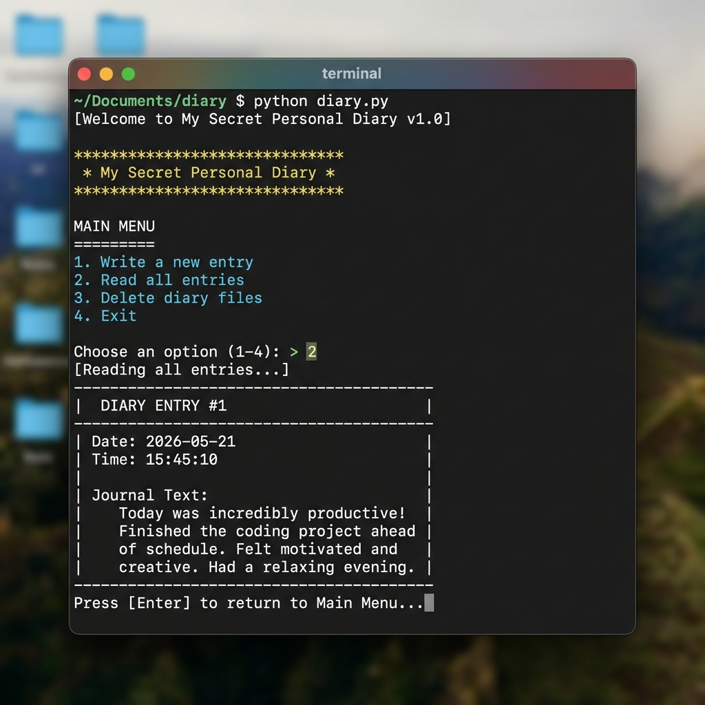

# Personal Diary Application

A lightweight, robust command-line interface (CLI) journal application written in Python. This project is built using standard libraries to show fundamental concepts of safe file streaming, data formatting, and explicit, user-friendly exception handling.

## 🖥️ App Preview


---

## 🚀 Features

- **Write Daily Entries**: Easily log your thoughts into a structured file format. Supports customizable custom dates or defaults to the current day.
- **Secure Stream Capturing**: Gracefully intercepts manual exit signals (`Ctrl+C` and `Ctrl+D` / `Ctrl+Z`) when writing so you never dump Python stack traces to the console.
- **Read Log entries**: Read your chronological journal entries inside structured console cards directly.
- **Automatic Backups**: Generates and syncs your records to a backup file (`diary_backup.txt`) at startup for data recovery.
- **Input Validation**: Actively catches format exceptions (e.g. incorrect dates) using explicit `try-except ValueError` triggers.
- **Zero Dependencies**: Pure Python script running exclusively on built-in standard libraries (`os`, `shutil`, `datetime`).

---

## 📦 Getting Started

### Prerequisites
Make sure you have Python 3 installed. You can check your version by running:
```bash
python --version
```

### Installation
Clone this repository to your local machine:
```bash
git clone https://github.com/mickey4sure/secretsliehere.git
cd journal
```

### Running the Application
Simply execute the main script from your terminal:
```bash
python journal.py
```

---

## 🛠️ Project Structure & Concept Showcase

This project is highly annotated to demonstrate fundamental Python software engineering topics:

1. **File I/O Stream Operations**:
   - **Append Mode (`"a"`)**: Safely appends new logs without altering older text entries.
   - **Read Mode (`"r"`)**: Streams stored bytes into local print memory blocks.
2. **Robust Exception Catch Blocks**:
   - Intercepts `FileNotFoundError` if accessing the database before creation.
   - Intercepts `PermissionError` if disk writes are write-protected.
   - Validates user input bounds using standard exceptions.

---

## 📄 License

This project is licensed under the MIT License - see the [LICENSE](LICENSE) file for details.
